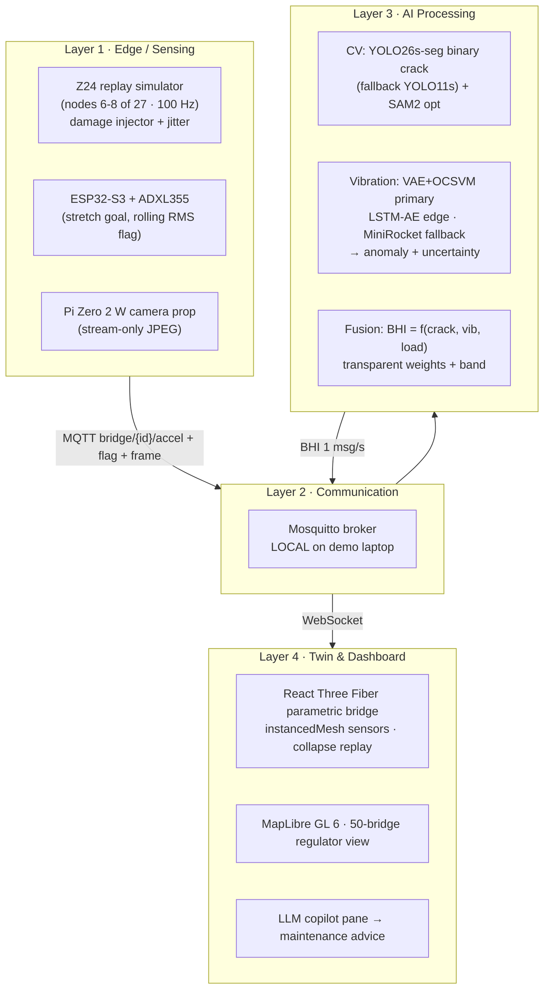

# System Architecture (frozen)

4 layers, one hero demo path. Frozen on Day 0 before any coding ([[Message-Contract]]).

## The 4 layers

## Message flow (hero path)

`simulator (1 msg/s/node) → MQTT → Postgres (persist) + WS bridge → models (cv + vibration) → fusion/BHI → twin + dashboard`

- Telemetry: ~6–8 msgs/s total (batched 100-sample JSON, 1 msg/s/node).
- QoS: telemetry 1, alarms 2 ([[Message-Contract]]).

## Replay-first principle

1. **Replay is authoritative** — all four subsystems consume a recorded Z24 replay through the real MQTT → DB → inference → twin pipeline.
2. The live ESP32 node is a garnish, shown only if a pre-demo smoke test passes (H8 cut rule, [[36h-Build-Plan]]).
3. Every screen source is **labeled** ("Z24 · 100 Hz", "simulated feed", "LIVE") — kills the integrity question ([[Storyboard]], [[QandA-Prep]] Q6/Q12).
4. Zero venue-WiFi dependence: local broker, offline fixtures ([[Digital-Twin]]).

Related: [[Four-Components]] · [[Message-Contract]] · [[Data-Pipeline]] · [[Tech-Stack]]
